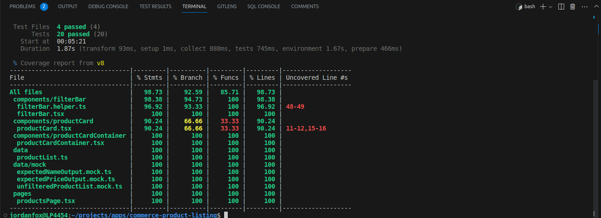

# Commerce product listing

### [visit deployed website](https://jordanfox1.github.io/commerce-product-listing/)
### How to start the server locally
* Copy the repo and cd into the root directory

* If pnpm is not installed, install it globally with npm by running `npm i pnpm -g` or by following this [guide](https://pnpm.io/installation)

* install dependencies -  `pnpm i`

* start the server -  `pnpm dev`

* run the tests -  `pnpm coverage` or `pnpm test`

*Here is the current Test coverage* 
### Potential Improvements
* For a more realistic simulation of fetching data from a server, I would prefer to use [JSON server](https://github.com/typicode/json-server)  in the dev environment. I have chosen not to in this case, in order to deploy it more easily.

* The integration tests would be better in a professional environment where the values are not hardcoded.

* The placeholder images take quite a long time to fetch which is kind of annoying.

* The image sizes could be more responsive and fetch a different sized image dynamically.

* the page itself is not very interactive and quite dry.

* There are no tests for the default loading state of the image.
